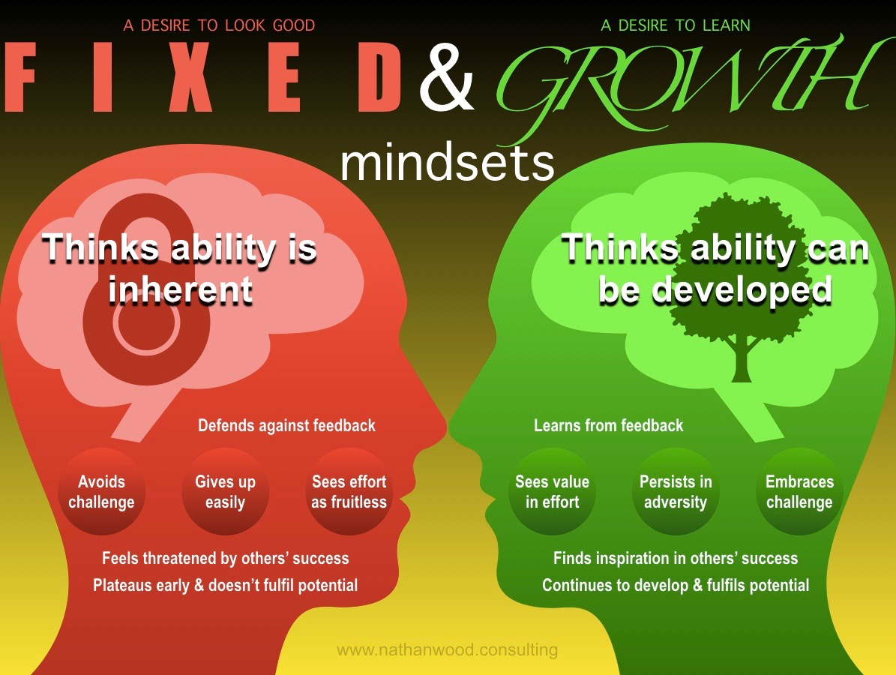

##Growth mindset
A growth mindset believes that one’s fundamental abilities can be developed through perseverance and effort; intelligence and talent are simply good starting points. A growth mindset is synonymous with a love of learning.

**Fixed mindset**
 Intelligence and talent are seen as fixed traits, suggesting that success comes from these inherent qualities alone, without the need for further development or effort.

Here's illustration shows the differences between a fixed and a growth mindset:

####Perseverance, gumption traps, and maintaining a growth mindset
* Challenges
* Obstacles
* Effort
* Criticism
* Success of others

###Challenges

Try not to be  in a fixed mindset and avoiding the problem by giving up.

Rather, think about the growth mindset. When you are ready, walk through the problem once again, bit by bit, looking for new ways to think about it until yiustart to see another way forward. Also, it always helps to talk through these steps – out loud, not just in my head.

###Obstacles
. A coworker calls this *instant gratification monkey syndrome* . It’s the idea that we’ll do just about anything other than the actual task at hand if it has suddenly become challenging, and especially when there are so many tempting diversions – articles, videos, email, social – mere clicks away.

**Robert Persig** talks about the *gumption trap* – the phenomenon of knowing what needs to be done, but lacking the motivation to do it.

His solution is to stand up, put down whatever project is sucking the gumption out of you, walk away, and return when you’re feeling more inspired.

Growing at work, and outside work too
I’ve found that taking the time to assess what I’m doing is tremendously effective in keeping me on track at work. When I feel myself losing focus, I try to remember that short-term frustration will likely result in long-term improvement of my abilities – if I just stay with it. A growth mindset opens me up to more creativity and possibility, and I discover I’m able to achieve more and set higher goals.

###Effort
The trite-but-true phrase “no pain, no gain” is pure growth mindset!

###Criticism
I’ve learned to ask myself two questions:

What was the best part of the day?
What went wrong, and how can I make sure it doesn’t happen again?
These questions help me focus on all aspects of my day, the good and the bad, and they help me internalize strategies for creating more good days going forward.

###Success of others
Where a fixed mindset leads you to see the success of others as a threat, the growth mindset encourages you to see the success of coworkers as an inspiration.

##3 growth mindsets to adapt:
* Place effort before talent.
Hard work should always be rewarded before inherent skill.

* Once you develop a growth mindset, own it. Acknowledge yourself as someone who possesses a growth mentality and be proud to let it guide you throughout your educational career.

* Intelligent people enjoy the learning process, and don’t mind when it continues beyond an expected time frame.
